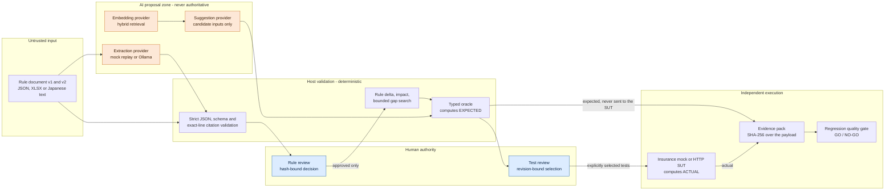
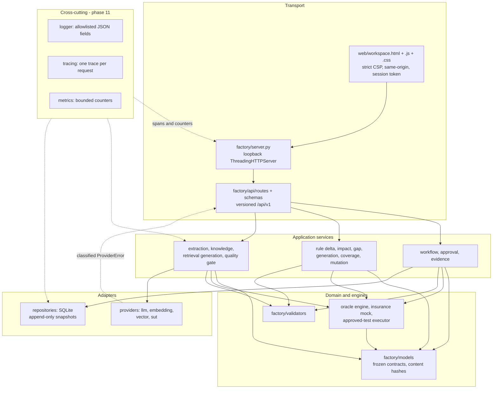
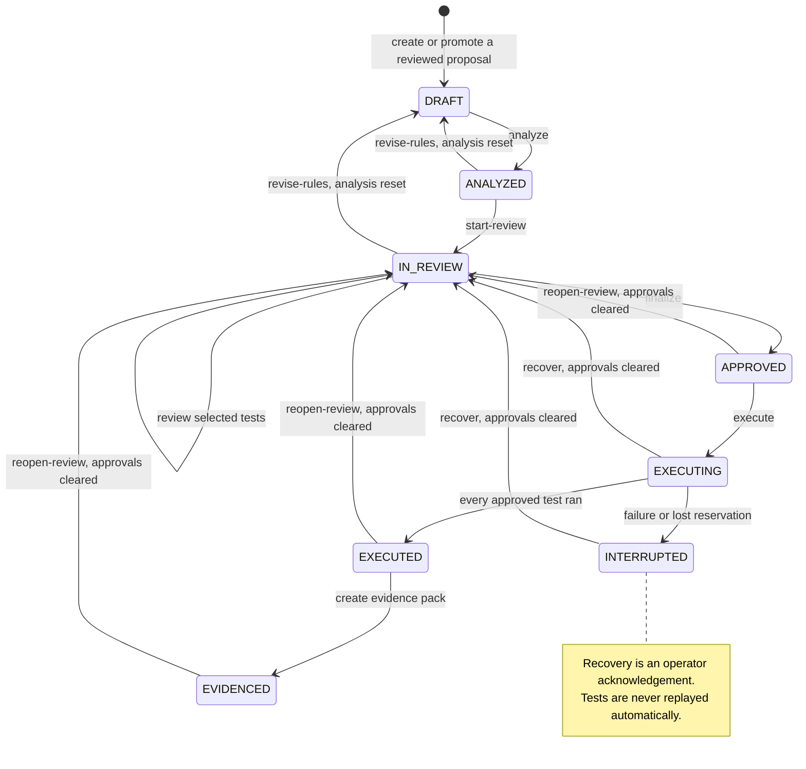

# Architecture diagrams

Three views of the same system. They render in GitHub markdown without any build step.

## 1. Trust boundaries — untrusted document to signed-off evidence

The single claim of this project: **AI proposes, deterministic engines decide, a human approves.**
Every arrow crossing a boundary is validated, and nothing crosses back.

**What the diagram encodes.** The SUT never receives the expected result or the rule snapshot. The provider never
sees the ground truth. No arrow returns from `SUT` to `ORACLE`. No path reaches `SUT` without passing through
`TREV`. A provider failure stops at `VAL` and is classified, never retried and never replaced by mock output.

## 2. Layers and dependency direction

Dependencies point downward only. Engines never import transport; the API never re-implements a business rule.

Observability is drawn with dotted edges because it observes; it never changes a decision. Metrics live in the
process only and reset on restart.

## 3. Review state machine

Taken from `factory/services/workflow_service.py` and `approval_service.py`. Every transition is an explicit
operator action bound to the current revision; a stale revision raises `ConflictError` and changes nothing.

Reopening review clears approvals and invalidates the current GO context: a gate verdict always belongs to one
workflow revision.

## Where the numbers come from

See [BENCHMARKS.md](BENCHMARKS.md) for every measured value with its source artifact, and
[OBSERVABILITY.md](OBSERVABILITY.md) for what the diagnostics surface does and does not record.
