# Phase 6: reviewed AI extraction

Phase 6 adds a provider boundary, Japanese synthetic source pairs, independently validated citations, immutable proposals and explicit rule review. Approved proposals can be promoted into the phase-4 workflow. Existing test review remains mandatory before execution.

The default provider is a scripted offline mock. An optional Ollama adapter is implemented, but no live model has been exercised in this implementation session. Mock replay results must not be presented as Japanese extraction accuracy.

## Quick start without an API key

```powershell
Set-Location -LiteralPath "E:\AI hackathon\rule2test"
$env:RULE2TEST_EXTRACTION_PROVIDER="mock"
python -B scripts/run_extraction_demo.py
```

This creates missing samples, saves a proposal to data/extraction-demo.db and stops at pending_review. It neither approves the rules nor creates a workflow. The output includes provider/model, simulated=true, source hashes and the proposal hash.

Evaluate the fixtures:

```powershell
python -B scripts/evaluate_extraction.py
```

The report uses the label mock_fixture_replay_checks. Four fixture checks cover eligibility, claim review, deductible and a source with an unspecified maximum age. This small report is not the phase-9 benchmark.

## Pipeline

```mermaid
flowchart LR
    S[UTF-8 V1 / V2 documents] --> P[Mock or Ollama provider]
    P --> V[Strict JSON + source-line validation]
    V --> D[Typed domain validation]
    D --> R[Persist immutable proposal]
    R --> H[Explicit SME rule review]
    H --> W[Atomic promotion to DRAFT]
    W --> A[Delta / impact / gap analysis]
    A --> Q[QA test review]
    Q --> E[Independent SUT execution + evidence]
```



Clarification, malformed output and provider errors are persisted for inspection and cannot be approved or promoted.

## Components

| File | Responsibility |
| --- | --- |
| factory/models/extraction.py | SourceText, ExtractionRequest, ExtractionProposal, ExtractionReview and ExtractionPromotion |
| factory/providers/llm/base.py | Provider protocol returning untrusted JSON text |
| factory/providers/llm/mock.py | Exact replay of known synthetic source pairs |
| factory/providers/llm/ollama.py | Optional loopback HTTP adapter with explicit model, timeout and response bound |
| factory/providers/llm/factory.py | Explicit provider selection with no automatic fallback |
| factory/providers/llm/prompt.py | Versioned prompt and document-only user message |
| factory/validators/extraction_validator.py | Strict output shape, line citation checks, compilation through phase-5 domain validation |
| factory/repositories/extraction_repository.py | Immutable proposal/review/promotion snapshots in the existing object store |
| factory/services/extraction_service.py | Provider orchestration, review gate and atomic workflow creation |
| scripts/extraction_cli.py | Extract, inspect, review and promote |
| scripts/seed_ai_samples.py | Create sources/tests/truth without overwriting existing files |
| scripts/evaluate_extraction.py | Small post-extraction semantic spot checks against separate truth |

No new dependency or database migration is required. The existing SQLite object store holds extraction records under a separate scope. Workflow creation was split into validation/preparation and transaction persistence so promotion and workflow creation commit together.

## Synthetic data

Each directory under data/ai_samples contains:

- rules_v1.txt and rules_v2.txt: natural Japanese business text.
- existing_tests.json: phase-5 test rows, specified against V1.
- ground_truth.json: separately declared expected changes for evaluation.

The three ready examples use age 60 -> 65, claim threshold 100M -> 150M VND, and deductible 5M -> 10M VND. The ambiguous example deliberately omits the new maximum age.

The mock recognizes only the exact three source pairs. Any edited or unknown text returns needs_clarification. Its ability to stop on the ambiguous example is scripted fallback behavior, not demonstrated natural-language reasoning.

The evaluator loads ground truth after extraction. It is never sent to the provider. The Ollama prompt also excludes existing test answers; host code preserves those tests and binds them to the extracted V1 snapshots.

## Input scope and limits

The phase-6 CLI accepts two UTF-8 .txt files with distinct filenames and different bytes, one per version. Rule/table IDs may remain stable when conditions do not change. Identical input bytes are rejected as duplicate version documents.

Each source is limited to 64 KiB and 1,000 lines. Existing tests are limited to a 256 KiB JSON string and 1,000 rows. Output is limited to 256 KiB, 50 rule-condition rows per version, two policy rows and 102 citations. Business semantics remain bounded by the phase-2 engine.

Free-layout XLSX extraction, PDF layout and OCR are not implemented. Structured XLSX import remains available through phase 5. The plain-text path establishes the provider/validation/review contracts before adding layout extraction.

## Output contract

The provider returns exactly:

```json
{
  "status": "ready",
  "issues": [],
  "policies": [],
  "rules_v1": [],
  "rules_v2": [],
  "citations": []
}
```

The empty arrays above illustrate the keys only; a ready response must contain complete rules and policies.

Policies and rule rows use the canonical columns in [IMPORT_FORMAT.md](IMPORT_FORMAT.md). The provider cannot supply tests, approvals, provider metadata or content hashes.

Every policy and rule row requires one exact source-line citation:

```json
{
  "path": "/rules_v2/0",
  "document_id": "rules_v2.txt",
  "line": 2,
  "quote": "加入年齢は18歳以上65歳以下の場合に加入を許可する。"
}
```

The validator checks target coverage, uniqueness, the source version, a positive integer line number, the exact full line, and agreement with the rule's quote. Host code computes source hashes. Policy citations are also included in rule provenance so the default-action source survives into typed evidence.

For unclear requirements, return needs_clarification with one or more issues and all other arrays empty. Partially executable rules in a clarification response are rejected.

A matching quote does not prove semantic correctness. For example, an incorrect lt operator paired with a valid quote can pass structural validation. The test suite explicitly demonstrates that case remains pending review and cannot be promoted without a human decision.

## Durable proposal states

| Proposal status | Meaning |
| --- | --- |
| pending_review | Schema, citations and domain validation passed; no review decision implied |
| needs_clarification | Provider declined to infer missing facts |
| invalid_output | JSON, citations, size or domain validation failed |
| provider_error | Provider request failed; exception details are not persisted |

Proposal status records the original validation result and is immutable. The review decision is a separate record, displayed by show. Corrections require a new extraction proposal; the old review and audit history remain intact.

Proposal hashes cover source text, supplied existing tests, provider/model, simulation flag, prompt version/hash, raw output, validation state, latency and creator metadata. Review records bind the complete proposal hash, reviewer label, decision, reason and timestamp.

Reviewer names are self-declared. Authentication, role enforcement and digital signatures are not implemented. Hash checks detect inconsistent content, not an administrator rewriting the entire database and hashes.

## Explicit review and promotion

Create and inspect a proposal:

```powershell
$p = python -B scripts/extraction_cli.py extract --v1 data/ai_samples/eligibility/rules_v1.txt --v2 data/ai_samples/eligibility/rules_v2.txt --tests data/ai_samples/eligibility/existing_tests.json --actor BA | ConvertFrom-Json
python -B scripts/extraction_cli.py show --proposal $p.proposal_id --full
```

After inspecting the source and interpretation, the reviewer may explicitly approve:

```powershell
python -B scripts/extraction_cli.py review --proposal $p.proposal_id --hash $p.proposal_hash --decision approved --actor SME --reason "Checked thresholds, inclusive operators, outcomes and source lines"
$w = python -B scripts/extraction_cli.py promote --proposal $p.proposal_id --hash $p.proposal_hash --actor BA | ConvertFrom-Json
```

To reject, use --decision rejected with the reason. There is no automatic rule approval. Missing review, rejection, wrong hashes and non-reviewable proposals block promotion.

Continue in the same database:

```powershell
$w = python -B scripts/workflow_cli.py --db data/extraction.db analyze --workflow $w.workflow_id --revision $w.revision --actor BA | ConvertFrom-Json
$w = python -B scripts/workflow_cli.py --db data/extraction.db start-review --workflow $w.workflow_id --revision $w.revision --actor QA | ConvertFrom-Json
$w | ConvertTo-Json -Depth 20
```

Then use the explicit test-review, finalize, execute and evidence commands in [WORKFLOWS.md](WORKFLOWS.md). Rule review and test review are distinct steps.

Promotion archives both original UTF-8 sources, the derived import document, the complete proposal and the review record. The workflow, source archives and promotion marker share one transaction. Failure rolls them back together. Repeating promotion returns the existing workflow rather than creating a duplicate.

## Optional Ollama provider

With an installed local model and a running local Ollama server:

```powershell
$env:RULE2TEST_EXTRACTION_PROVIDER="ollama"
$env:RULE2TEST_EXTRACTION_MODEL="your-installed-model"
python -B scripts/extraction_cli.py extract --v1 data/ai_samples/eligibility/rules_v1.txt --v2 data/ai_samples/eligibility/rules_v2.txt --actor BA --timeout 60
```

The adapter uses POST /api/chat, stream=false and format=json, as documented in [Ollama's chat API](https://docs.ollama.com/api/chat) and [structured-output guidance](https://docs.ollama.com/capabilities/structured-outputs). JSON formatting is followed by independent application validation.

The endpoint is fixed to http://127.0.0.1:11434; proxy use and redirects are disabled. It does not download a model or fall back to mock if the model fails. The CLI supports a 1..120 second socket timeout; this is not a hard process-wide deadline or guaranteed cancellation of model computation. There are no automatic retries.

Transport behavior is tested with mocked HTTP responses. No claim is made about live Japanese extraction quality, latency or cost. Cloud providers remain future adapters.

The older web demo uses OLLAMA_MODEL; the new typed pipeline uses RULE2TEST_EXTRACTION_PROVIDER and RULE2TEST_EXTRACTION_MODEL. The .env.example file is documentation only; environment variables must be set in the process.

## Verification

```powershell
python -B -m unittest tests.unit.test_extraction tests.integration.test_extraction_workflow -v
python -B -m unittest discover -s tests
```

Tests cover wrong-version citations, incorrect quotes and line numbers, missing policy citations, unknown/duplicate output fields, prompt separation, ambiguity fallback, transport errors, hash-bound review, transactional rollback, idempotent promotion and Japanese provenance in final evidence.

The typed extraction workflow currently runs through Python services and CLI. The legacy web interface and Streamlit scaffold are not connected to it.
